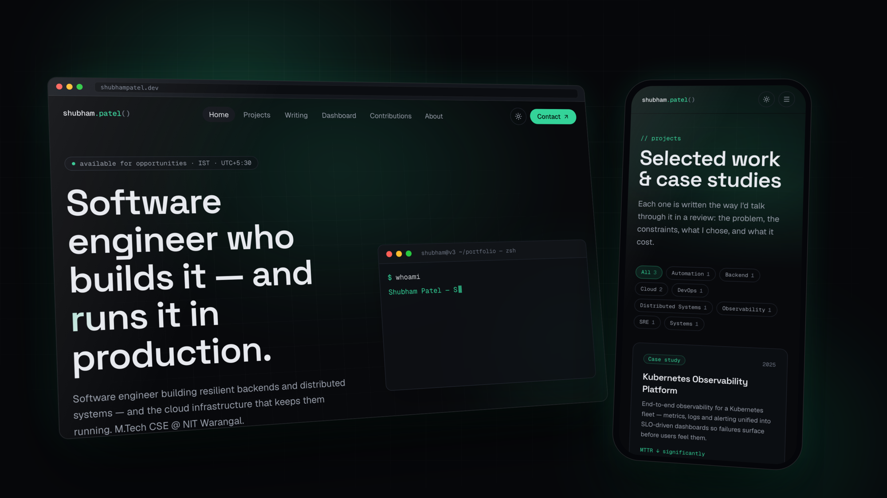
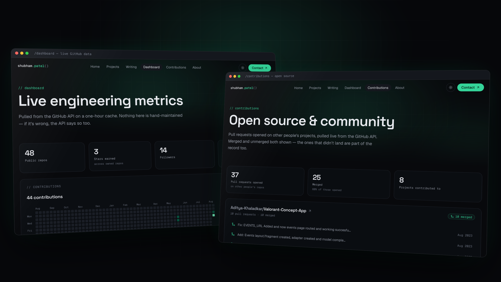

<div align="center">


<br />
<br />

**Backend and distributed systems — and the cloud infrastructure that keeps them running.**

<br />

[](https://github.com/Shubham-Patel07/shubhampatelv3/actions/workflows/ci.yml)
[](LICENSE)
[](https://nextjs.org)
[](https://react.dev)
[](https://www.typescriptlang.org)
[](https://tailwindcss.com)
[](#)

<br />



</div>

<br />

## `// what this is`

A personal site built to be read the way an engineer would want to read one.

Case studies that explain the **tradeoffs** rather than list technologies.
Dashboards that pull **real numbers from an API** rather than repeating whatever
was true the day they were written. Dark-first, one accent colour, and no
component library — every element in here is built from scratch.

<br />

<div align="center">



<sub><b>Nothing on these two pages is hand-maintained.</b> The numbers come from the GitHub API on a one-hour cache — if they're wrong, the API says so too.</sub>

</div>

<br />

## `// what makes it different`

<table>
<tr>
<td width="50%" valign="top">

### Case studies, not screenshots

Each project reads as **problem → constraints → architecture → decisions _with their costs_ → outcomes → what I'd do differently**.

The tradeoffs are the point. Anyone can list a stack.

</td>
<td width="50%" valign="top">

### Live data, degraded honestly

`/dashboard` and `/contributions` read the GitHub REST, GraphQL and search APIs.

Every call resolves to `null` or a status rather than throwing, so a rate limit degrades **one panel**, not the route — and the UI separates _"not configured"_ from _"request failed"_.

</td>
</tr>
<tr>
<td width="50%" valign="top">

### A design system, not a theme

Every colour is a CSS variable surfaced to Tailwind via `@theme inline`.

Change `--accent` in `app/globals.css` and the **entire site** reskins.

</td>
<td width="50%" valign="top">

### Motion that yields

Smooth scroll, scroll reveals, magnetic buttons, a cursor spotlight, a canvas globe you can spin.

Every one of them **no-ops under `prefers-reduced-motion`**.

</td>
</tr>
<tr>
<td width="50%" valign="top">

### Zero-registration writing

Drop an `.mdx` file into `content/writing/` and it publishes. No list to register it in.

Frontmatter drives metadata; reading time is computed from the body.

</td>
<td width="50%" valign="top">

### Responsive on purpose

Verified at **390 / 768 / 1024** with a scripted harness, not by eye.

Includes the fixes you only find on real devices — like iOS zooming any input under 16px and never zooming back.

</td>
</tr>
</table>

<br />

## `// built with`

| Layer | Choice |
| :--- | :--- |
| **Framework** | Next.js 16 — App Router, Turbopack |
| **Language** | TypeScript, React 19 |
| **Styling** | Tailwind CSS v4, CSS-variable design tokens |
| **Motion** | Framer Motion, Lenis |
| **Content** | MDX, gray-matter, reading-time |
| **Data** | GitHub REST + GraphQL + search APIs, ISR |
| **Hosting** | Vercel |

<br />

## `// running locally`

```bash
npm install
cp .env.example .env      # fill in the values below
npm run dev               # → http://localhost:3000
```

<details>
<summary><b>Environment variables</b></summary>

<br />

| Key | Required | Purpose |
| :--- | :--- | :--- |
| `NEXT_PUBLIC_SITE_URL` | for metadata | Canonical URL for OpenGraph, sitemap and robots |
| `GITHUB_USERNAME` | yes | Whose data the dashboard reads |
| `GITHUB_TOKEN` | recommended | Raises the API rate limit and enables the contribution graph, which is GraphQL-only |
| `WAKATIME_API_KEY` | optional | Reserved for coding-hours metrics; unused today |

> **Use a public read-only token.** The site never writes to GitHub. A token
> carrying `repo` write, `workflow` or `delete:packages` scope has no business
> in a deployment environment.

**Without `GITHUB_TOKEN` the site still builds and runs** — the dashboard falls
back to unauthenticated rate limits and the contribution graph reports that it
isn't configured. CI builds with no token at all, precisely to keep that true.

</details>

<details>
<summary><b>Scripts</b></summary>

<br />

```bash
npm run dev          # dev server
npm run build        # production build
npm start            # serve the production build
npm run lint         # eslint
npm run gen:icons    # regenerate lib/data/tech-icons.ts from the icon sets
```

`scripts/responsive-shots.sh <route> <out.png> 390 768 1024` screenshots a route
at several widths at once.

It renders the site inside **fixed-width iframes** deliberately: macOS clamps
Chrome's minimum window to ~500px, so `--window-size=390` silently lays out at
500 and merely *crops* to 390 — which imitates a horizontal-overflow bug that
isn't there.

</details>

<details>
<summary><b>Repo map</b></summary>

<br />

```
app/                 routes, metadata, sitemap and robots
components/
  ui/                design-system primitives
  home/              homepage sections
  projects/          case-study rendering
  dashboard/         panels, stat tiles, contribution heatmap
content/writing/     blog posts (.mdx) — add a file, it publishes
lib/
  data/              all copy and content, kept out of components
  github.ts          GitHub API layer; never throws
  writing.ts         filesystem-backed post index
docs/
  ROADMAP.md         build phases and the house rules worth not rediscovering
scripts/             icon generation, responsive screenshots
```

</details>

<br />

## `// license`

**All rights reserved.** This code is published for reference and portfolio
purposes only — see [LICENSE](LICENSE). Dependencies remain under their own
licenses.

<br />

---

<div align="center">
<sub>Built by <a href="https://github.com/Shubham-Patel07">Shubham Patel</a> · <a href="https://www.linkedin.com/in/shubham2107patel">LinkedIn</a></sub>
</div>
